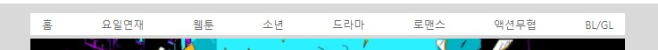
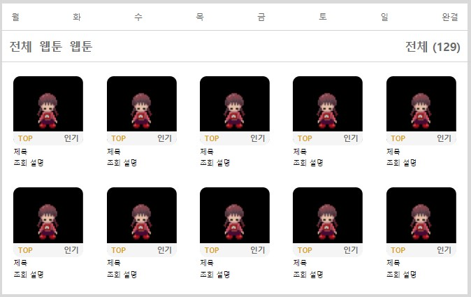
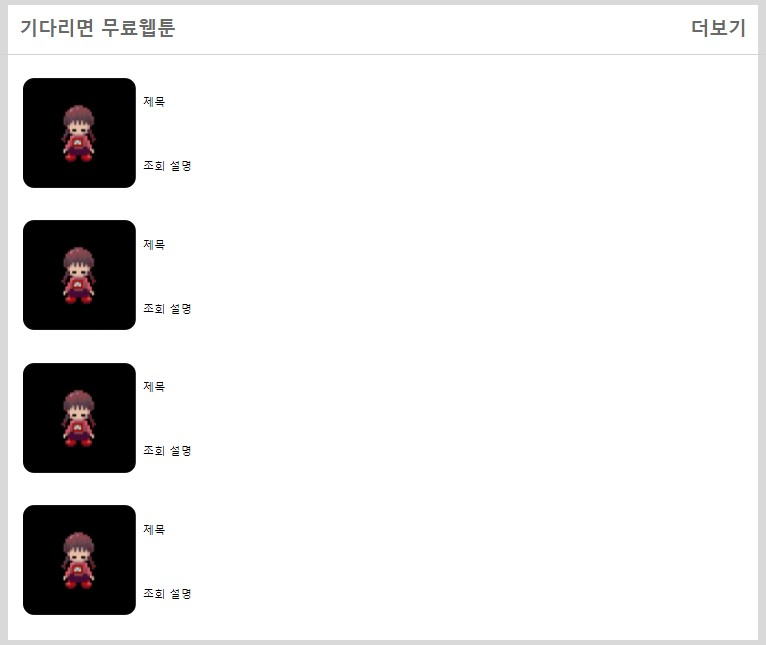
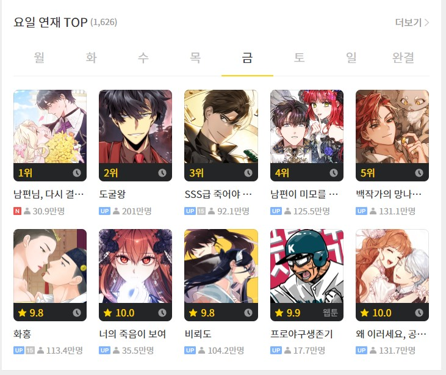
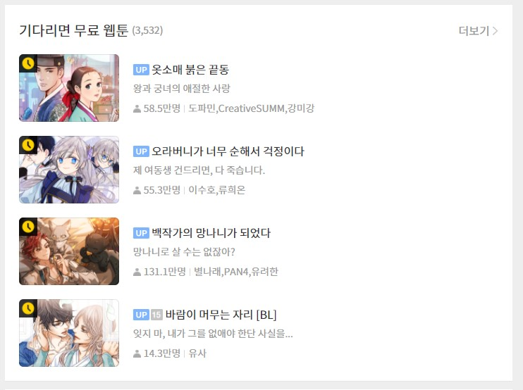
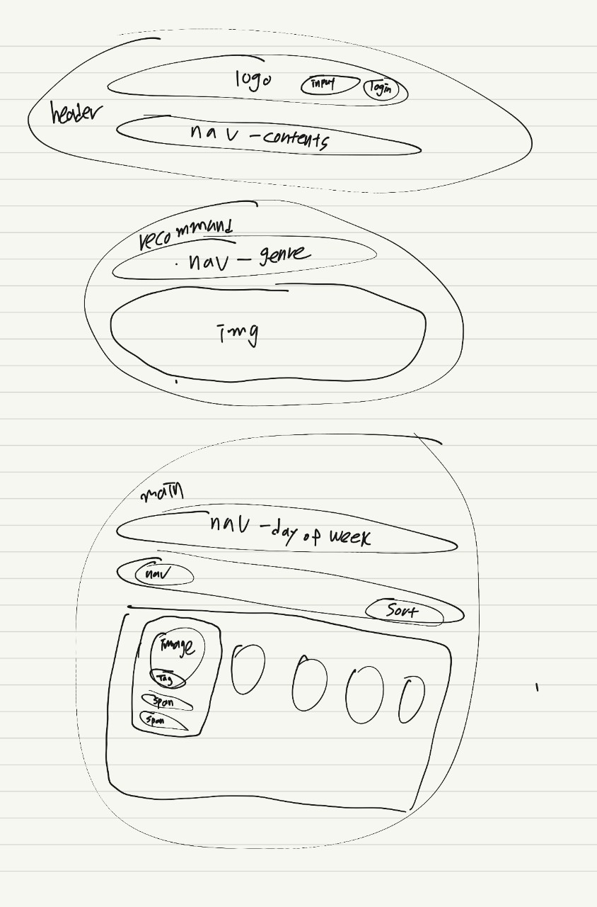
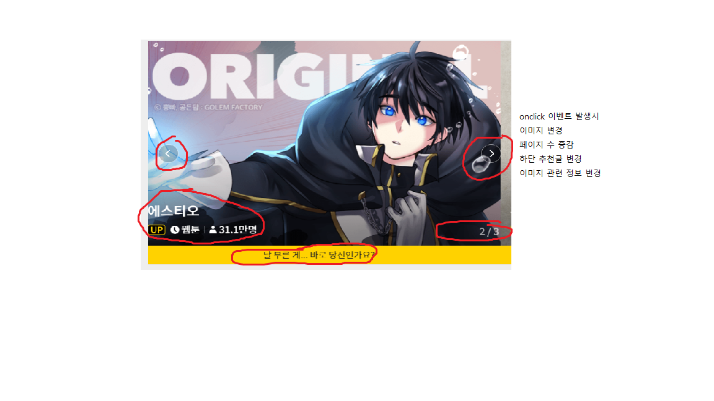
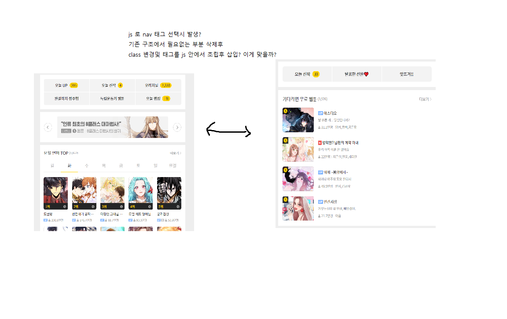
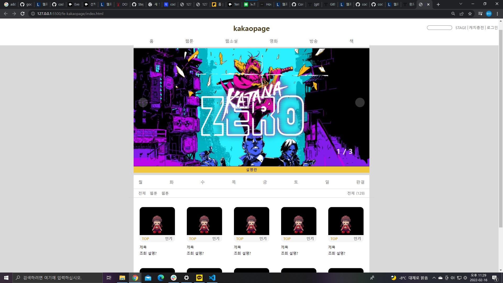
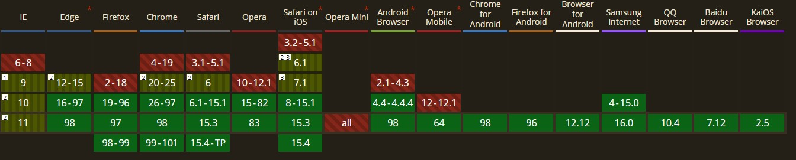

# fe-kakaopage

# step2 미션관련 목표 체크리스트

- [ ] css 리팩토링
- [ ] js 리팩토링
- [x] 이미지 슬라이드 (무한 루프 실패)
- [x] 홈 화면 클릭시 하단 구성 배치 변경
- [ ] 요일 연재 클릭시 기존 화면으로 재배치
- [x] 깃로그 스타일 변경해보기

# 이벤트 발생 부분

1. 이미지 슬라이더는 좌우 클릭시 넘어가게 구현하였습니다.

   - 무한으로 좌우 변경은 고민을 더 해야할것 같습니다.

2. 요일연재 클릭시 하단부 컨텐츠 레이아웃 변경을 구현하였습니다.

  

요일연재 클릭시

이화면이 세로로 변경, 배치변경, 네브 폰트,  
그리고 4개의 웹툰 컨텐츠만 담는 컴포넌트 복사붙이기로 구현하였습니다.

아래 그림은 카카오 페이지 입니다.

## 미션 1 - 카카오페이지 클론-HTML,CSS개발

---

### 학습목표

- HTML 태그 활용
- CSS 기반 동작원리 이해
- CSS 레이아웃 구성 원리 이해
- HTML,CSS 지식을 활용한 웹 단일 페이지 개발
- HTML,CSS 기본 디버깅 방법

---

### 프로그래밍 요구사항

HTML

- HTML는 용도에 맞는 tag를 찾아서 사용한다.
- HTML5 Layout 태그를 활용한다.

CSS

- 모든 엘리먼트들은 가지런히 배치해야하고, 일정한 간격을 유지하도록 한다.
- 배치를 할때 flex 속성을 사용한다.

제출방법

- [깃 fork 후 로컬에서 진행하고 PR보내는법](https://lucas.codesquad.kr/masters-2022/course/%EC%9B%B9%ED%94%84%EB%A1%A0%ED%8A%B8%EC%97%94%EB%93%9C-%ED%81%B4%EB%9E%98%EC%8A%A4/%ED%95%99%EC%8A%B5%EA%B0%80%EC%9D%B4%EB%93%9C/PR---%EC%BD%94%EB%93%9C%EB%A6%AC%EB%B7%B0-%EA%B3%BC%EC%A0%95)

---

### 미션도중 기록

계획

- layout 잡기 -> 사전 기획서를 보며 큰단위들로 나누어 단위를 나누어 사용한다.

  

- 마크업? -> 처음 해보는데 flex박스를 사용하여 해보았다. -> 느낀점: 내가 하는게 맞는지 틀린지 판단이 안되어 괴롭다.
- css스타일링 -> 만들어놓은 컨테이너 단위별로 스타일링을 해줬다.
  - -> refactoring을 어떻게 해야할지 난감했다. 우선 하드코딩하는 부분이 많아서 변수로 자주 사용되었거나 사용할 값들을 만들어서 최대한 사용했다.
- 동적 기능 필요부분 분석하기.

      
     ---> 좌우버튼 클릭시  
      
      이미지 변경 및 이미지 카운트 text 증감 이미지 관련정보 text 변경  
      이미지 애니메이션 css를 통해 제어를 생각중

    

   ---> nav바 클릭시

      만들어둔 메인 컨텐츠 레이아웃 변경
      flex-direction을 변경하면 해결가능할 것이라 예상 이때 텍스트의 규격을(높낮이)
      이미지의 높이와 맞추면 되지 않을까?

---

## step1 마무리 사항

 

### step 1 노력한점

- 목표1. 간격 선 맞추기

- 목표2. 이미지 크기 맞추기 (아쉬움 있음)

- 목표3. 하단 컨텐츠 재사용가능하게 만들기

- 목표4. 최대한 한페이지 따라 만들어보기

### step 1 아쉬웠던점

- !! js Dom탐색을 querySelector와 children으로 만 탐색한점  
  -> Dom 탐색을 할때 자꾸 class이름만 떠올리는 습관이 배어버렸는데 다른 방법을 강구 해볼것 ex) getElementby.../ dom.childNodes?...
- !! css 스타일코드를 그때그때 필요할때마다 만들어서 사용한점 (하드코딩)  
  -> 개선할점: 재사용성 고려한 설계? oocss? 스타일을 작은단위로 나누어 필요할때마다 사용하기?

- 깃으로 너무 많은 시간을 잡아 먹은점 깃 터미널 환경...  
  -> 아직 어떻게 해결해야 할지 감이 안옴... 생활코딩 지옥에서 돌아온 깃 강의 틈틈히 보기?
- 대충 계획하기 시작한점 마음이 급해서 조금이라도 빨리하려다 되려 혼쭐남  
  -> 다음주 부터 계획을 쓰고 내가 만족스럽지 않으면 코딩을 하지 않을것
- 코딩 도중 스모킹 테스트. 이유를 찾지 않고 하나하나 실험만 한점  
  -> 앞으로 문제 발생시 멈춰서 오류를 자세히 분석할것 조급한 마음에 습관이 깨져버림
- 기록을 하지 않은점 미션중 모르면 검색하고 모르면 검색하고 패닉에 빠졌음  
  -> 이를 방지하기 위해 학습중 readme에 모르는 사항을 꾸준히 적어야 겠다 느낌

- 오타 디버깅의 고통... html과 css가 오타를 안잡아줘서 디버깅하는데 2시간을씀...  
  -> 해결책을 찾아야함... 아이디어가 없음

### 크롱의 피드백

1. vw의 지원범위

   

   Global usage = 98%  
    -> 전세계적 비율만 보았을때는 사용해도 무방해 보인다고 생각했다.  
    그런데 왜 이질문을 던지셨을까 나혼자 고민을 좀 해보고 표를 보았는데
   대부분 2021년 부터 지원이 가능해진 곳이 많았다. (안드로이드 모바일 분야에서 특히)

2. vw와 반응형 웹이 아닐때 장점이 무엇일까?  
   -> vw를 단순 배치를 깔끔하게 하기 위해서 사용했다.  
   우선 검색으로 유추 했을때 반응형을 제외하고 우수하다 느낀점은 calc()  
   시너지가 우수하단점? 이라고 생각했다. ex) height: calc(100vh - 50px)  
   또한 %는 부모의 넓이와 길이에서 %값을 이용한다고 조언을 들었는데  
   vw, vh는 보이는 각에서 부터 %를 따지므로 부모값을 무시해야할 상황에서
   빛을 발하지 않을까 생각한다. !!테스트중 전화와서 다시 테스트 해야함 js bin 사용하기 !!

3. 반복되는 리스트들이면 UL, LI 사용  
   -> 작성예정

---

## step2

계획

- css파일 컴포넌트 별로 나누고 css 단위를 나눠보기
- hover 효과 nav에 부여
- 이벤트 계획 구체적으로 짜보기
- 현재 이미지 슬라이드는 그대로 두고 컨텐츠 부분을  
  만들어둔 컴포넌트 최대한 재사용 해보기 재사용 가능한 부분과  
  어떻게 재사용 할지 알아보고 코딩하기
- DOM 탐색 다시 학습 할것 또한 createElement 말고도 생성, 추가 더 알아볼것

검색 및 고민하고 시작할 사항

- 반복되는 dom요소 js로 복사 삽입하기  
  -> cloneNode(), cloneNode(true) 자식까지 복사
- 이벤트 하나 더 만들것 탐색하고 분석하기
- js로 컴포넌트를 어떻게 효율적으로 생산하는지  
  -> temlplate literal + InnerHTML
- 이벤트 발생 시킨후 기존 이벤트로 효율적으로 돌아올 방법?  
  -> css는 이후 추가된 클래스가 우선순위가 높으니깐?
  이벤트 발생 레이아웃 클래스를 하나 덧대어서 배치를 바꾸는법?  
   (아이디어라 테스트가 필요하다. 럼카의 pr 사항중에 클래스를 중복으로 사용한 점이  
   우수하다 한점을 차용해 보자)

---

## 노드탐색

### CSS선택자를 이용한 요소 노드 취득

- document.querySelector을 이용하여 인수로 전달한 CSS선택자 만족시키는  
  하나이상의 요소노드만 반환 (복수를 원할시 querySelectorAll 사용 []로 요소노드반환)

### 부모노드 탐색

Node.ParentNode

- 부모 노드를 반환한다.

### 자식 노드 탐색

 
Node.childNodes

- 자식 노드를 모두 탐색하여 NodeList에 담아 반환  
  이떄 반환된 NodeList에는 요소 노드 뿐만 아닌 텍스트 노드도 포함됨

Node.children

- 자식 노드중에서 요소 노드만 모두 탐색하여 HTMLCollection에  
  담아서 반환함 텍스트 노드가 포함되지 않는다.

Node.firstChild

- 첫 번째 자식 노드를 반환. 반환값은 텍스트 노드이거나 요소노드이다.

Node.lastChild

- 마지막 자식 노드를 반환. 반환값은 텍스트 노드이거나 요소노드이다.

Element.firstElementChild

- 첫번째 자식 요소 노드를 반환한다. 반환값은 요소 노드이다.

Element.lastElementChild

- 마지막 자식 요소 노드를 반환한다. 반환값은 요소 노드이다.

Tip: 요소노드의 텍스트 노드탐색 방법

- document.getElementById('example').firstChild // #text

### 형제 노드 탐색

 

Node.previousSibling

- 부모 노드가 같은 형제 노드 중에서 자신의 이전 형제노드를 탐색후 반환  
  반환 하는 형제 노드는 요소 노드 뿐만 아니라 텍스트 노드일 수 있다.

Node.nextSibling

- 부모 노드가 같은 형제 노드 중에서 자신의 다음 형제 노드를 탐색하여 반환  
  반환하는 형제 노드는 요소 노드 뿐만 아니라 텍스트 노드일 수 있다.

Element.previousElementSibling

- 부모 노드가 같은 형제 요소 노드중 자신 이전의 형제 요소 노드 탐색후 반환  
  요소 노드만 반환한다.

Element.nextElementSibling

- 부모 노드가 같은 형제 요소 노드중 자신 다음의 형제 요소 노드 탐색후 반환  
  요소 노드만 반환한다.

### 요소 노드의 텍스트 조작

nodeValue VS textContent

- nodeValue: 텍스트 노드를 참조할시 텍스트를 반환한다. 이때 텍스트 노드가 아닐시  
  null을 반환하므로 의미가 없다(쓰기불편).

  - ex) document.getElementbyID('example').nodeValue // null 이다 - document.getElementbyID('example').firstChild.nodeValue // text값이 나온다.

- textContent: 요소노드를 참조해도 텍스트를 반환한다. textContent 프로퍼티에  
  문자열을 할당하면 요소 노드의 모든 자식 노드가 제거되고 할당한 문자열이  
  텍스트로 추가된다. HTML 마크업이 포함되어도 문자열 그대로 인식되어 텍스트  
  취급이 된다.
  - ex) document.getElementbyID('example').textContent = `HI there</there>`  
    결과는 `HI there</there>` 문자열 그대로

---

받았던 조언들

- 옐로우 조언: 컨테이너 간격 하드코딩에 대해 (키워드 :: after, before)
- 머핀 과의 토론과 조언: css로 display:none 으로 처리와 js로 동적 처리의 차이점 -> dom트리가 결국 브라우저에 계속 남아있으므로 그때그때 필요할때마다 쓰는게 좋지 않을까? 로 판결 또한
  개발자 도구로 이를 확인 할 수 있으므로 노출되는 부분이 커지는것 또한 단점인듯 하다.
  (js로 부모 태그 삭제시 자식태그도 싹다 삭제된다.)

의문점  
css 파일을 하나 더파서 이벤트 관련 스타일을 임의 클래스에 저장하고
이벤트 발생시 클래스 이름을 교체하는 식으로 스타일링 한 는 것은 좋은 방법일까?
