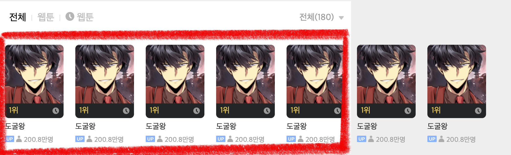
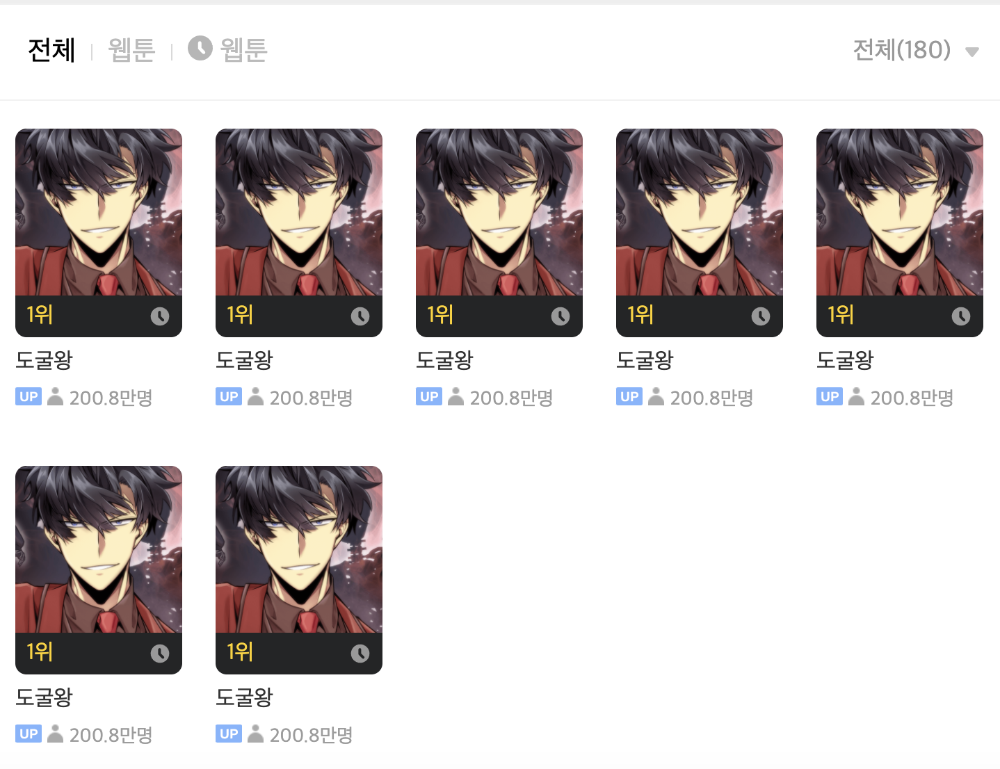
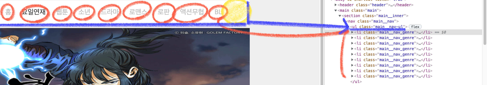
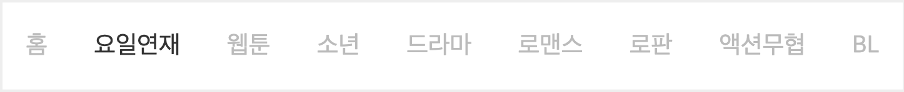
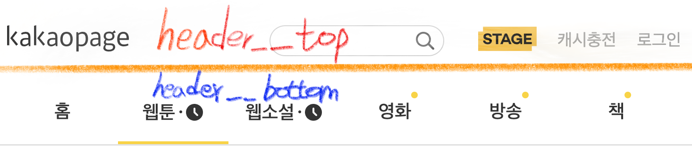

## `카카오페이지 클론-HTML,CSS개발`

> 카카오페이지 UI를 클론하는 미션, 👀 기획서에서 동적인 탭UI 기능은 개발하지 않고 정적인 HTML,CSS 화면 구성

> HTML는 용도에 맞는 tag를 찾아서 사용, 일정한 간격을 유지하며 모든 엘리먼트들은 가지런히 배치 => 배치를 할때 flex 속성을 사용

article tag ? 문서 혹은 요소가 독립적으로 존재할 수 있을 때 사용  

section tag ? 논리적으로 관계 있는 문서 혹은 요소를 분리할 때 사용

---

### 기능 요구사항

기획서 링크 https://docs.google.com/presentation/d/1ez1rBqgAP9vQtr6_xiQW8Gn8WTncW1-s0sZaGnDm6FI/edit#slide=id.gad474f1470_0_8)

---

### 접근방식

1. https://page.kakao.com/main?categoryUid=10&subCategoryUid=10000 페이지에서 중간 네비게이션 탭에 따라 아래(main 영역) UI가 살짝만 바뀐다는 점을 인지하였다. (html 파일 하나만 사용)  

2. 제일 먼저 menu 중 요일연재 tab을 기준으로 html 마크업 진행

3. CSS는 BEM 방법론을 사용하여 한 번 적용해보기 위해 BEM 에 대하여 학습

4. 요일연재 tab 메뉴 선택 시 CSS 적용  

5. 다른 tab 메뉴에 따라 html main 영역 마크업 진행

6. JS로 동적 이벤트 구현

### 브라우저 렌더링 과정 ?  

> 렌더링 엔진은 HTML 문서를 한줄씩 순차적으로 파싱하며 DOM을 생성해나간다. 생성과정에서 CSS를 로드하는 link 태그 혹은 style 태그를 만나면 DOM 생성 중지후 CSS파싱의 결과물인 CSSOM을 생성하는 과정을 진행!

1. HTML 문서를 파싱한 후 DOM Tree 구축

2. CSS 파싱 후, CSSOM Tree 구축

3. DOM, CSSOM을 조합하여 Render Tree 구축 (Render Tree에는 스타일 정보가 설정되어 있으며 실제 화면에 표현되는 노드들로만 구성) 여기서 display: none; 속성이 설정된 노드는 Render Tree 과정에서 제외!

4. Layout 단계 : 브라우저 뷰포트 내의 각 노드들의 정확한 위치, 크기 계산! Render Tree 노드들이 가지고 있는 스타일, 속성에 따라 브라우저 화면의 어느 위치에 어느 크기로 출력될지 계산하는 단계

5. Paint 단계 : 레이아웃 단계가 완료가 되면 요소들을 실제 화면에 그리게 된다.

### Flexbox 사용법

1. 플렉스 박스를 배치할 자식 요소들의 부모 태그에 플렉스 박스를 앞으로 쓸거다라고 알려줘야 한다.

```css
    display: flex;
```

2. 가로 정렬 ? 세로 정렬 ?

```css
    flex-direction : row;
```

- 가로 방향 정렬 : row / 세로 방향 정렬 : column

> 가로 정렬인 row로 셋팅 시 Main axis는 가로축, Cross axis는 세로축을 의미

> 세로 정렬인 column로 셋팅 시 Main axis 세로축, Cross axis는 가로축을 의미

3. 무조건 한 줄 안에 다 정렬 ?  

```css
    flex-wrap: nowrap;
```

flex-wrap은 감싸지 않고 자식의 사이즈를 줄여서라도 한 줄로 정렬하려는 속성! flex-wrap의 default 값은 nowrap이다.  

(Ex. 부모 width: 1000px, 자식요소 3개가 각각 width가 400px 일 때, flex-wrap: nowrap으로 속성 설정 시 각 자식 요소의 width는 250px로 변경된다.)  

  

빨간색으로 칠해진 영역이 이미지들의 부모 컨테이너 인데 부모 컨테이너 영역에 flex-wrap의 default 값인 no-wrap 일때는 자식 태그들의 width값 합이 부모 width: 720px 보다 커지면 흰 화면 바깥으로 계속 배치된다.

  

이번엔 부모 컨테이너 영역에 flex-wrap: wrap; 속성을 준 화면이다. 자식 태그들의 width 합이 720px이 넘어가면 자연스럽게 아래로 배치되었다.

4. 플렉스 박스를 사용하여 이제 정렬!  

FlexBox는 보이지 않는 두 개의 Axis로 정렬한다.  

Main axis 조정 -> justify-content 속성으로!  

Cross axis 조정 -> align-items(하나의 axis), align-content(전체의 큰 axis) 속성

`👀 flex 속성이 뭐지 ? `

flex 속성 기본값은 flex: 0 1 auto (flex-grow, flex-shrink, flex-basis 을 의미한다.)   

1. flex-grow : 속성값이 0이면 flex container의 크기가 커져도 flex item의 크기가 커지지 않고 원래 크기로 유지, flex container의 크기가 커질 때 flex item의 크기도 커지게 하려면 1 이상의 값을 속성값으로 설정한다. 속성값이 1 이상이면 flex item의 원래 크기에 상관없이 flex container를 채우도록 flex item의 크기가 커진다.  



부모 컨테이너(ul태그의 main__nav-ul)의 자식 태그들 flex-grow 값이 default 값인 0일 때는 위 그림처럼 홈 ~ BL 메뉴가 왼쪽에 치우쳐져 있다. BL 오른쪽 빈공간이 홈 왼쪽에 비해 너무 많이 남아있음



> 모든 항목의 flex-grow 값을 1로 지정하면 사용가능한 공간은 각 항목에게 동일하게 분배한다.

2. flex-shrink : 속성값이 0이면 flex container의 크기가 flex item의 크기보다 작아져도 flex item의 크기가 줄어들지 않고 원래 크기로 유지된다. 속성값이 1 이상이면 flex container의 크기가 flex item의 크기보다 작아질 때 flex item의 크기가 flex container의 크기에 맞추어 줄어든다.  

3. flex-basis : flex item의 기본 크기를 결정하는 속성 -> 기본값은 auto / flex-basis 속성의 값을 auto로 설정하면 flex item은 상대적 flex item(relative flex item)이 되어 콘텐츠의 크기를 기준으로 크기가 결정된다.  

** 밑에 네이버에서 정리되어있는 flex 속성 부분을 복사해온 내용이다. 더 자세한 내용은 아래 링크를 참조하면 된다.

출처 : https://d2.naver.com/helloworld/8540176#ch2-2-4

---

### HTML 시맨틱 태그

시맨틱은 의미를 뜻하며 시맨틱 태그는 우리가 작성하는 태그에 의미있는 태그를 붙이자 라는 개념이다.  

아무 의미 없는 태그인 div, span 태그는 영역을 분리할때는 가급적 피하고 정말 의미를 지니는 태그들인 header, nav, section, article, footer 속성들로 레이아웃 구조를 잡자!  

`시맨틱 태그 사용 장점 ? `

1. 퍼블리셔, 다른 프론트엔드 개발자들이 html 문서를 보지않고도 코드만으로 해당 영역이 어디인지? 어떤 내용이 담겨져 있을지 시맨틱 태그로 예상할 수 있다.

2. 검색 엔진 최적화 Up (따로 마케팅을 이용하여 광고를 하지 않아도 의미 있는 태그들로 인하여 우리가 작성한 웹 사이트의 요소들을 해석할 수 있다.)

---
### BEM 방법론 ?  

로직을 작성하는데 있어서 여러 디자인패턴이 존재하듯 CSS에도 다양한 여러 패턴? 방법론들이 존재한다.  

그중에서도, 이번에 CSS 클레스 네이밍을 BEM 방법론을 한 번 이번에 도입하여 사용해보려 한다.  

BEM은 Block, Element, Modifier를 의미하며 저 3가지를 각각 __, --로 구분한다.  

1. Block ? 특정 영역을 감싸고 있어 독립적으로 분리할 수 있는 부분

2. Element ? 블럭을 구성하는 단위로 의존적이다. 블럭 내에서만 사용이 가능하기 때문에 따로 떼어서 독립적으로 사용 불가

3. Modifier ? Block/Element의 속성을 담당

그럼 BEM의 장점 ? 네이밍만으로 목적과 기능을 명확히 전달할 수 있는게 가장 큰 장점

BEM의 단점 ? 

1. 아무래도 block, element에 __, --를 붙여서 사용하다 보니 클래스이름이 너무 길어진다.

2. 특정 DOM의 클래스를 복사해서 가져오려고 할 때 불편하다. 하이픈과 언더바의 혼용으로 인하여 더블클릭으로 한 번에 class 선택이 안된다는점 => 속성태그를 언더바(_) 기준으로 하면 이 단점은 해결된다고 생각한다. (실제로 bem document에선 속성을 언더바로 사용하라고 소개한다.)

### 카카오페이지 상단 헤더 부분만 BEM으로 작성해보자  



위 헤더쪽 레이아웃만 우선 BEM 방법론을 적용해보았다.

```html
<header class="header">
    <div class="header__inner">
        <div class="header__top">
            <h1 class="header__logo">
                
            </h1>
            <div class="header__search">
                <form class="search__form">
                    <input class="search__input" type="search"/>
                </form>
                
            </div>
            <div class="header__buttons">
                <button class="header__button">
                    
                </button>
                <button class="header__button">캐시충전</button>
                <button class="header__button">로그인</button>
            </div>
        </div>
        <div class="header__bottom">
            <nav class="header__nav">
                <ul class="header__ul">
                    <li class="header__menu"><a class="header__link" href="#">홈</a></li>
                    <li class="header__menu header__menu_active"><a class="header__link" href="#"></a></li>
                    <li class="header__menu">
                        <a class="header__link" href="#">
                            
                        </a>
                    </li>
                    <li class="header__menu">
                        <a class="header__link" href="#">영화
                            <div class="header__link_circle"></div>
                        </a>
                    </li>
                    <li class="header__menu">
                        <a class="header__link" href="#">방송
                            <div class="header__link_circle"></div>
                        </a>
                    </li>
                    <li class="header__menu">
                        <a class="header__link" href="#">책
                            <div class="header__link_circle"></div>
                        </a>
                    </li>
                </ul>
            </nav>
        </div>
    </div>
</header>
```

먼저 마크업을 어느정도 해준 후 각 DOM에 BEM 방법론을 적용해본 소스다.  

1. 헤더를 감싸고 있는 부분을 Block이라 생각하여 header라는 이름으로 블록을 선언하였다.  

2. header 내부엔 크게 2개 영역으로 나눠진다고 생각하여 div태그로 각각 header__top, headeR__bottom Element로 표현  

3. header__top 요소 내에서는 또 3개의 영역으로 생각하였다. 
    - 맨 왼쪽엔 header__logo 
    - 중앙엔 검색 인풋을 포함하는 header__search => 여기서 form, input 태그 클래스명을 어떻게 지을지 고민을 했다.  
    > search__form ? header__search--form ? 두 클래스 네이밍중에 뭐가 더 적합할까 생각을 해봤는데, 둘 다 괜찮고 뭘 사용해도 좋다고 생각하지만, search__form 네이밍 만으로도 해당 요소가 검색폼이라고 인지할 수 있고 불필요하게 네이밍을 길게 하는건 안좋다고 생각하여서다. 또한 가급적 modifier을 붙이는 속성은 더 직관적이고 명확한 태그에만 적용하는게 좋다고 생각했다.
    - 오른쪽 영역엔 3개의 버튼들을 감싸는 header__buttons

4. header__bottom 요소 내에서는 메뉴들을 관리하는 네비게이션 태그를 사용하여 header__nav > header__ul > header__menu > header__link 로 네이밍을 지어주었다.  

5. 속성이라고 생각되는 태그들에는 상위 요소태그 클래스 네이밍 + 언더바(_)를 사용하여 연결하였다


`BEM 관련 참고 사이트 `

1. https://en.bem.info/

2. https://en.bem.info/methodology/css/#how-do-i-make-an-html-wrapper  

---

### 가상요소 선택자 js로 스타일 변경  

가상 요소 선택자란 ? 특정 DOM 요소의 내용을 추가적으로 삽입하거나 선택할때 사용하는 연산자로 클래스 이름 앞에 콜론 두개(::) 를 붙여서 표시한다. 대표적으로 ::before(특정 요소 앞), ::after(특정 요소 뒤)가 존재하며 ::first-letter, ::first-line 등 여러 가상 요소 선택자가 존재

css에서 var변수를 사용할 수 있다는건 알고 있었지만 이걸 응용해서 가상요소 선택자의 스타일링 입힌건 처음이라 정리하였다. 현재 var변수를 정의하여 사용할 수 있는 브라우저 버전으론 IE를 제외한 최신 브라우저에선 동작한다.  

```css
.footer__business .footer__business_info::after {
    content: '';    
    width: 10px;
    height: 10px;
    display: inline-block;
    background: var(--background, url(./images/icon_trace_off.png));
    background-repeat: no-repeat;
    background-position: 50% 50%;
    background-size: 100%;
}
```

위 css 코드에서 after 가상요소 선택자 스타일링 background 속성에 var 변수를 사용하여 --으로 시작하는 이름으로 --background 변수 이름을 정의하고 2번째 인자엔 해당 속성의 초기값을 적어주면된다.   

```javascript
businessInfoEl.addEventListener("click", ()=> {
    if(businessInfoEl.classList.contains("footer__business_info_off")) {
        businessInfoEl.style.setProperty("--background", "url(images/icon_trace_on.png)");
    } else if(businessInfoEl.classList.contains("footer__business_info_on")) {
        businessInfoEl.style.setProperty("--background", "url(images/icon_trace_off.png)");
    }
});
```  

businessInfoEl DOM에 click 이벤트리스너를 달아 특정 css가 포함되어 있는지 체킹하여 해당 DOM의 setProperty 함수로 첫번째 매개변수는 var 변수 이름으로 선언한 변수 이름, 두번째 매개변수는 변경값이 담긴다. 

👀 이렇게 var 변수를 선언하여 사용하면 위 가상요소 선택자에 스타일링을 줄 수 있을뿐만 아니라 여러곳에서 같은 스타일링을 재사용할 수 있어서 유지보수에 굉장히 좋다고 생각한다.  

---

### Event delegation ?  

이벤트 위임이라고도 불리우는 이 개념은 같은 클래스명을 공유하는 여러개의 엘리먼트에 한 번에 이벤트를 주기 위해서 사용되어진다.  

querySelectorAll을 사용하여 한꺼번에 DOM 들을 찾고 이벤트를 달 때 for문을 사용하는 것만 약간 다르지.. 전체적은 방법은 비슷하다!  

현재 카카오페이지 상단 gnb 메뉴에는 9개가 존재한다. 여기 메뉴마다 querySelectorAll로 돔들을 모두 찾아와 이벤트를 달수야 있다. 하지만 앞으로 메뉴를 나타내는 갯수를 확장해야 한다면 ?  

=> 브라우저가 기억하고 있어야 하는 이벤트 리스너 갯수가 많아져서 메모리를 많이 사용해야 한다는 단점이 존재.

그럼 이런 단점들을 제거하기 위하여 이벤트 위임은 어떻게 사용할까 ?  

👀 상위 엘리먼트 하나에만 이벤트를 줘서 하위 엘리먼트들의 이벤트를 제어하면 된다!  

```html
<ul class="main__nav-ul">
    <li class="main__nav_genre"><a class="main__nav_link">홈</a></li>
    <li class="main__nav_genre"><a class="main__nav_link main__nav_link_active">요일연재</a></li>
    <li class="main__nav_genre"><a class="main__nav_link">웹툰</a></li>
    <li class="main__nav_genre"><a class="main__nav_link">소년</a></li>
    <li class="main__nav_genre"><a class="main__nav_link">드라마</a></li>
    <li class="main__nav_genre"><a class="main__nav_link">로맨스</a></li>
    <li class="main__nav_genre"><a class="main__nav_link">로판</a></li>
    <li class="main__nav_genre"><a class="main__nav_link">액션무협</a></li>
    <li class="main__nav_genre"><a class="main__nav_link">BL</a></li>
</ul>
```

카카오페이지 클론 코딩을 진행하며 마크업한 gnb 메뉴 영역이다. li 모든 태그에 이벤트 리스너를 다는게 아닌 ul 태그 하나에만 달면 된다!  

```javascript
const categoryEl = document.querySelector(".main__nav-ul");
    categoryEl.addEventListener("click", (e) => {
        if(e.target.tagName === 'A') {
            this.changeColor(categoryEl.children);
            e.target.classList.add('main__nav_link_active');
        }
    });
```

li 태그들에 이벤트를 달기 위하여 li를 관리하는 ul(부모태그)를 main__nav-ul 클래스이름으로 가져왔다.  
해당 ul태그에 이벤트 리스너를 달게되면 아래 li > a에 모든 이벤트가 걸리게 된다!

---

### 카카오 웹툰 페이지 공통 컴포넌트 분리 작업  

> 웹툰 페이지 전체를 살펴보면서 공통으로 뺄수 있는 컴포넌트가 어떤게 있을까 자세히 살펴보았다. 모든 영역들이 거의 비슷하게 사용하는걸 발견하여 어떻게 컴포넌트를 나누면 좋을지 나름 정리하였음

1. IssueComponent

  

상단 영역에서 카테고리 메뉴 바로 아래에 위치하는 내용들인데 여러 url에서 저런형태로 안의 텍스트만 다르고 형태는 똑같아 저 형태를 담당하는 컴포넌트 하나를 만들어 주면 좋겠다 생각했다. 네이밍은 우선 이슈들을 담당한다고 생각하여 IssueComponent로 지었음..

2. BannerComponent  


위 컴포넌트 또한 많은 곳에서 사용되어져서 분리하였다. 이름은 광고를 의미하기 때문에 간단하게 BannerComponent  

3. ImagePoster Component


정말 여러곳에서 사용되어지는 컴포넌트다! 이 컴포넌트를 어떤식으로 작게 나눌지 고민중이기도 하다! 지금 생각으론 2개의 컴포넌트로 나눌까 생각중이다. ( ImagePoster - 주황색 선을 기준으로 위쪽 이미지, 보라색 영역 / ImagePosterDetail - 노란색 영역)
- 이미지 사이즈가 다르다  
- 보라색 영역의 배치가 다르다 (이미지 위에 배치? 아래에 배치?)
- 노란색 영역에 들어가는 내용이 다르다.

4. Row 방향으로 흐르는 Container  


빨간색 영역은 많은곳에서 사용하는 영역이라 이것도 TopicComponent로 분리하였고 그 아래(주황색, 노란색) 영역은 왼쪽에서 오른쪽 방향으로 배치되는 row flex 레이아웃 안에 ImagePoster 컴포넌트들이 배치되고 있다.  

🤔 고민중..

- 이미지 크기를 다르게 표현하기 위해 해당 영역을 의미하는 값을 파라미터로 받아 ImagePoster 컴포넌트에 전달?

- 보라색 영역도 마찬가지로 파라미터로 imageStatus 라는 변수 값으로 제어할까 생각중이다.

5. Column 방향으로 흐르는 Container


상위 빨간색 영역 TopicComponent, 주황색, 노란색 영역들은 위에서 아래 방향으로 배치되는 column flex 레이아웃으로 row 방향으로 흐르는 컨테이너와 동일하게 똑같이 안에 ImagePoster 컴포넌트들을 배치하면 된다고 생각한다.