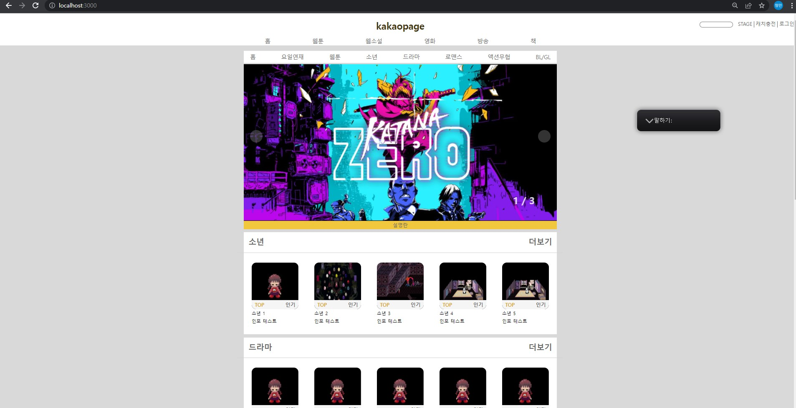

# step-3

1. 미션 1

   - [ x ] 탭을 누르면 하위 콘텐츠가 변경되어 노출된다 -> 웹툰 배너의 nav탭의 홈 요일연재 두곳 변경

   - [ x ] 탭 선택 시, 화면 새로고침이 일어나지 않는다.

   - [ ] 웹툰 영역을 기본으로 개발하고, 추가 메뉴들도 동작하게 한다. -> 추가로 더 구현해보고 싶다.

     - [ x ] 웹툰의 경우 요일별 탭 선택이 동작해야 한다. -> 요일 별로 클릭시 데이터를 필터해서 추가하게 구현 시도함

     - [ ] 추가 메뉴들의 하위콘텐츠 구성은 완전하지 않아도 상관 없다.

2. 미션 2 -> 로컬 호스트로 접속시 화면이 나오게 테스트만 해보고 원리는 1도 이해를 못해서 학습 후 다시 도전

   - [ ] npm project 를 이해하고 , npm 기반 개발 환경을 만든다.

   - [ ] Express 서버를 설치하고 이를 활용해서 서버를 띄워서 화면을 볼 수 있도록 한다.

3. 미션 3 애니메이션 -> 미구현

---

## 미션 1

### 변경점

기존에는 하나의 기본 레이아웃에서 이벤트가 발생 할때마다
기존 이미지로 초기화후 해당 이벤트의 필요한 스타일과 태그 혹은 컴포넌트들을 추가 해야지
라고 막연하게 계획을 한점을 변경 하였다.
이유는

1. 너무 노가다 스럽다. querySelector로 하나 하나 필요한 부분을 추출하는고 스타일 등록하고 display:none 하는 방식은 지금은 단위가 작아서 가능할 수 있지만 커질 수록 불가능하다 느꼈다.
   그리고 이벤트가 다양한데 이걸 다 일일히 수행하는건 불가능 하다.

2. 브라우저에게 부담이 된다. 매번 모든 요소들을 초기화 하는 과정을 다시 기본 페이지를 렌더링 하는건데
   조그마한 변화에도 모든걸 바꾸는건 자원 낭비이다. 필요한 부분만 바꿀 수 있어야한다.

3. 이벤트를 또 다시 등록해야한다. 이점을 몰랐어서 왜 안되는지 조금 해매다가 깨달았다.

해결 -> 이벤트 발생마다. 필요 부분만 삭제&추가&변경 할 수 있게 계획을 수정하였다. 이 과정중  
중요한 점이 뭘까 고민했는데 재사용성이 좋은 함수를 만드는것이 아닐까? 라 생각하고 처음으로  
재사용을 고려하며 코드를 짜려 노력했다.

### 목표

1. 시도: 폴더, 파일, 코드를 내가 할 수 있는 최선에서 정리 & 재사용성 있는 함수 구현하기

-> 함수들을 정리할때 몇 시간을 고민해도 재사용 적이지 못하고 중복되는 코드가 많았다.

-> 문제를 판단하지 못 하여 조언을 구했는데. innerHTML, dom조작 둘중 하나만 사용하는걸 피드백 받았다.

-> innerHTML로 조금 수정을 하니 이전 보다는 확실히 깔끔해 졌다. 그리고 고칠점이 조금씩 보일것 같다.

-> 아직 함수안에 createElement 가 들어간 부분도 추출하면 component반환 함수들이 문자열만 반환하게 통일 시킬 수 있을것 같다.

-> 아직 매우매우 미흡하다. 재사용성 좋은 코드를 짜는 스킬은 꾸준히 노력해야 늘것 같다.

2. 시도: Data 만들고 이를 토대로 화면의 요소들을 생성해보기

-> 이전에는 data란 말이 뭔지 몰라서 스킵하고 진행하였다 결과 엄청난 코드 복붙이 필요했다.

-> js로 컴포넌트를 작성하려 하니 어떤식으로 구현할지 막막하여 다른분들 구조를 보다가 모두 data를 쓰는걸 깨달았다.

-> 이후 화면 구성을 data 조작을 통해 이뤄 질 수 있게 수정하려 노력했다.  
 데이터를 통해서 화면을 조작하니 빠르고 할 수 있는게 많아 즐거웠다.

3. 요일별로 하위요소 변경 및 이벤트 등록과 삭제

-> dom 요소가 삭제 될때마다. 이벤트를 재등록 해줘야한다. 이유는 등록된 돔이 삭제되고 재정의 될때
이벤트가 부활 하는게 아니기 때문이다.

-> 어떤식으로 한번에 등록할 수 있을까 고민중 선택을 내리지 못하였다.

-> body에 domContentsLoaded이벤트를 추가하고 이벤트 수행 내용으로 모든 요소의 이벤트를 다시 추가할까?  
라는 생각을 하였는데 이러면 삭제 되지 않은 나머지 요소들이 중복으로 이벤트가 추가된다.

-> 생성 할때마다 등록 해야 할까?? 가장 유력하다 느낀다. 지금은 단위가 작지만 이벤트 투성이인  
페이지라면 이것도 한계가 있지 않을까?

-> 이벤트 블락도 고민중인데 팀원중 이벤트 발생마다 특수한 html 클래스명을 추가하고 이를 토대로  
이벤트 발생을 막는 분의 아이디어가 인상적 이였다. 다양한 방식이 있는것 같아 검색을 해봐야겠다.

-> data에서 웹툰마다 프로퍼티로 day: "요일"을 추가하여 요일별 탭 발생시 필요한 정보만 가져올 수
있게 구현해보았다. 이렇게 하면 랭킹도 만들 수 있을것 같다.

---

미션 2

### 목표

로컬 호스트로? 정적 파일을 한번에 클라이언트에게 보내기?

아직 단어가 익지 않아서 이런 식으로 목표를 새우고 express getting start페이지를 읽어 나갔는데

어떤식으로 동작하는지 이해는 잘 되지 않았다. 우선 local호스트로 띄우는건 되었는데 원리를 모르므로
실패라고 간주한다.

오늘은 인터넷 블로그와 문서들을 뒤지면서 동작이 어떤 순서로 되었는지 알아 보고 싶다.

---

미션 3

미구현
